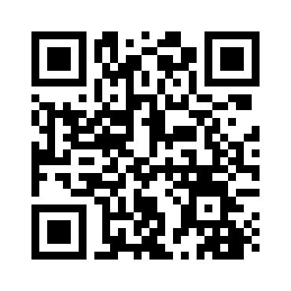

<p align="center">
  
</p>

<p align="center">
  
  
  
</p>

# 🔳 Python QR Code Generator

<p align="center">

</p>

<p align="center">
A simple and practical <b>Python mini project</b> that generates a QR code from any URL and saves it as a <b>PNG image file</b> using external libraries.
</p>

---

#  Project Overview

This project demonstrates how to generate a QR code using Python in just a few lines of code.

It converts a URL into a QR image file that can be scanned using any smartphone camera.

Example used in this project:

```
Instagram Page → Learning Daily AI
```

Generated Output:

```
qrcode.png
```

---

# ✨ Features

✔ Generate QR code from any URL
✔ Save QR code as PNG image
✔ Lightweight Python script
✔ Uses external Python libraries
✔ Beginner-friendly automation tool

---

# 🧠 Concepts Demonstrated

| Concept          | Implementation      |
| ---------------- | ------------------- |
| Python Libraries | `qrcode`            |
| Image Processing | `Pillow`            |
| Automation       | URL → QR conversion |
| File Handling    | Saving PNG image    |

---

# 📦 Libraries Used

### 1️⃣ qrcode

Used to generate QR code from text or URL input.

Install with:

```
pip install qrcode
```

---

### 2️⃣ Pillow

Used for image processing and saving QR code as PNG format.

Install with:

```
pip install pillow
```

---

# ⚙️ How It Works

The program follows three simple steps:

1️⃣ Import the qrcode library
2️⃣ Generate QR code from URL
3️⃣ Save QR code as PNG image

---

# 🖥️ Example Code

```python
import qrcode

qr = qrcode.make("https://www.instagram.com/learningdailyai/")
qr.save("qrcode.png")

print("QR code generated and saved as qrcode.png")
```

---

# 📂 Project Structure

```
Python_QR_Code_Generator
│
├── generate_qr.py
├── qrcode.png
└── README.md
```

---

# ▶️ How To Run

### Step 1 — Install dependencies

```
pip install qrcode
pip install pillow
```

### Step 2 — Run script

```
python generate_qr.py
```

After running the script:

```
qrcode.png
```

will be generated automatically.

---

# 🖼️ Output Preview

Add your generated QR screenshot here:

```

```

---

# 💡 Use Cases

This script can be used for:

📱 Sharing social media profiles
🌐 Website links
📂 File download links
🎓 Educational resources
📊 Quick-access project demos

---

# 🛠️ Tech Stack

<p align="center">

</p>

---

# 🌐 Connect With Me

<p align="center">

<a href="https://instagram.com/mesum_mukhtar">

</a>

<a href="https://leetcode.com/c2ktwf5gnt">

</a>

<a href="mailto:mesummukhtar3@gmail.com">

</a>

<a href="https://www.linkedin.com/in/mesummukhtar/">

</a>

</p>

---

# 👨‍💻 Author

**Mesum Mukhtar**

Built as part of continuous learning and exploration in Python automation projects.

<p align="center">
⭐ If you like this project, consider giving it a star ⭐
</p>

<p align="center">

</p>
